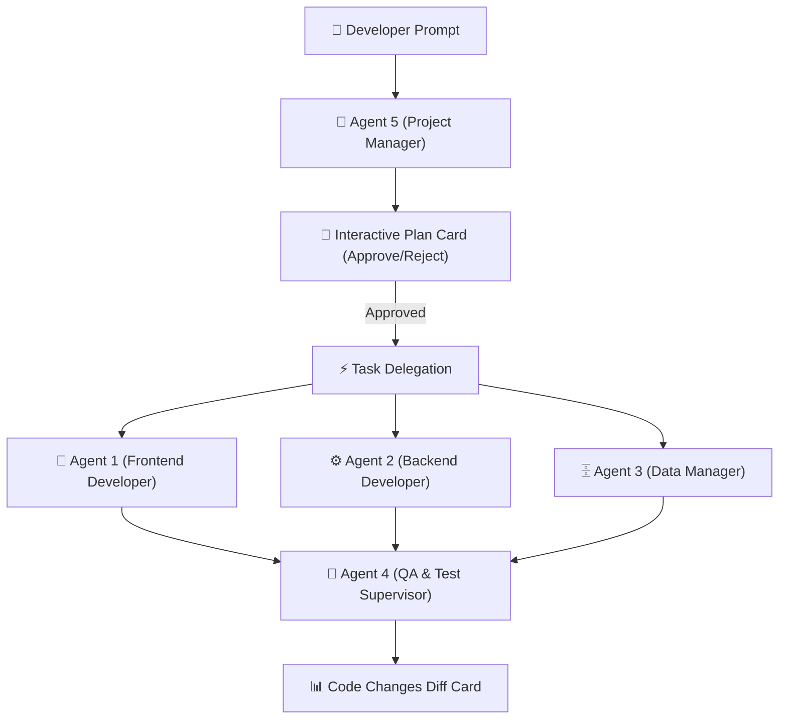

# Multi-Agent Software Development System for VS Code 🚀

An autonomous **5-agent AI pair-programming assistant** integrated natively into VS Code. Designed for full-stack software development, architectural planning, automatic framework skill execution, and test verification.

---

## 🏗️ Architecture & Multi-Agent Workflow

---

## 🌟 Key Features

- **Autonomous 5-Agent Team**:
  - 🤖 **Agent 5 (Workspace Manager)**: Manages architectural state, plans tasks, updates `PROJECT_STATE.md`, and delegates implementation.
  - 🎨 **Agent 1 (Frontend Developer)**: React, Vue, TSX/JSX layout, and UI component engineering.
  - ⚙️ **Agent 2 (Backend Developer)**: FastAPI REST endpoints, controllers, Pydantic schemas, and routing.
  - 🗄️ **Agent 3 (Data Manager)**: SQL schemas, database models, and Alembic migrations.
  - 🧪 **Agent 4 (Supervisor / QA)**: Pytest & Jest test suite generation and automated test verification.

- **Interactive Implementation Plans**:
  - Generates interactive plan cards with `[📄 Review Plan]`, `[✅ Approve & Execute]`, and `[❌ Reject / Edit]` controls directly inside VS Code.

- **Unified Code Changes Card Widget**:
  - Tracks diffs across workspace files and displays a Cursor-style diff summary with direct review links to `CHANGES_LOG.md`.

- **Multi-LLM Provider Support**:
  - Seamlessly switch between local **Ollama** (`qwen3-coder:latest`), **OpenAI** (`gpt-4o`), **Groq** (`llama-3.3-70b`), **DeepSeek**, and **Anthropic** via VS Code Settings.

- **Automatic Skill Activation**:
  - Auto-activates built-in framework skills (`fastapi-backend`, `react-frontend`, `vue-frontend`, `database-migration`, `unit-testing`) based on prompt context.

---

## ⚙️ Extension Settings

Access settings via `Ctrl + ,` (or `Cmd + ,`) and search for `Multi-Agent`:

| Setting | Type | Default | Description |
| :--- | :--- | :--- | :--- |
| `multiAgent.provider` | `enum` | `"ollama"` | LLM provider backend (`"ollama"`, `"openai"`, `"groq"`, `"deepseek"`, `"anthropic"`). |
| `multiAgent.apiKey` | `string` | `""` | API key for cloud LLM providers. |
| `multiAgent.modelName` | `string` | `"qwen3-coder:latest"` | Default model name (e.g. `'qwen3-coder:latest'`, `'gpt-4o'`). |
| `multiAgent.pythonPath` | `string` | `"python"` | Path to Python binary (or workspace `.venv` path). |
| `multiAgent.serverPort` | `number` | `8000` | FastAPI server port number. |
| `multiAgent.serverHost` | `string` | `"127.0.0.1"` | FastAPI server host IP. |
| `multiAgent.autoStartServer` | `boolean` | `true` | Automatically launch backend server process on VS Code startup. |
| `multiAgent.requirePermission` | `boolean` | `true` | Require user approval before executing file writes or system commands. |

---

## 💻 Commands

Access from the Command Palette (`Ctrl + Shift + P` / `Cmd + Shift + P`):

- **`Multi-Agent: Start Backend Server`**: Launches the Python backend server process manually.
- **`Multi-Agent: Restart Backend Server`**: Kills and restarts the server process.
- **`Multi-Agent: Open PROJECT_STATE.md`**: Opens persistent project memory in the editor.

---

## 🚀 Quickstart Guide

### 1. Install Extension
Install from the VS Code Extensions tab (`Ctrl + Shift + X` $\rightarrow$ search `Multi-Agent Dev System`).

### 2. Configure LLM Provider
- **For Local Ollama**: Ensure Ollama is running (`ollama run qwen3-coder:latest`).
- **For OpenAI / Cloud LLMs**: Open Settings $\rightarrow$ set `multiAgent.provider` to `openai` and paste your `multiAgent.apiKey`.

### 3. Open Workspace & Start Coding
Open any project folder, click the **Multi-Agent System** icon in the activity bar, and ask Agent 5 to build your feature!
